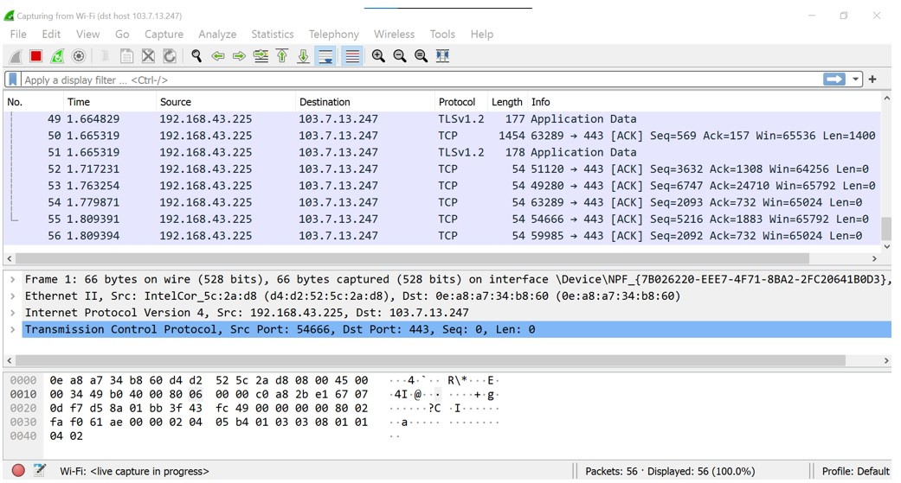

# Jarkom-Modul-1-D12-2021
Laporan Resmi Praktikum Jaringan Komputer 2021 - D12
- Nur Hidayati (05111940000028)
- Pramudityo Prabowo (05111940000210)
- Muhammad Rizky Widodo (05111940000216)

## Soal No. 1
Sebutkan web server yang digunakan pada "ichimarumaru.tech"! 

Pada soal ini, kita menggunakan display filter untuk menampilkan semua paket yang spesifik menuju ke atau berasal dari alamat ichimarumaru.tech dengan mengisi
```http.host contains "ichimarumaru.tech"``` pada display filter. 

</img><br>

Setelah itu pilih paket teratas/salah satu paket lalu ke menu Analyze lalu follow -> TCP Stream maka akan keluar.

</img><br>

dapat dilihat dari gambar server yang digunakan adalah  nginx/1.18.0 (Ubuntu).
## Soal No. 2
Temukan paket dari web-web yang menggunakan basic authentication method!

Pada soal ini kita menggunakan display filter. Dengan mengisi display filter dengan  ```http.authbasic```  maka akan muncul paket yang menggunakan basic authentication method

</img><br>

## Soal No. 3
Ikuti perintah di basic.ichimarumaru.tech! Username dan password bisa didapatkan dari file .pcapng!

Pada soal ini kita menggunakan display filter. Dengan mengisi display filter dengan ```http.host contains basic.ichimarumaru.tech``` 

</img><br>

Setelah itu saya menklik paket ke2 lalu ke Hypertext Transfer Protocol (dibagian bawah) -> authorization  dan disitu terdapat credentialsnya yaitu id ```kuncimenujulautan``` dan passwordnya ```tQKEJFbgNGC1NCZlWAOjhyCOm6o3xEbPkJhTciZN``` untuk masuk ke website basic.ichimarumaru.tech

Setelah masuk ke websitenya disana disuruh menyelesaikan soal dengan jawaban sebagai berikut.

</img><br>

## Soal No. 4
Temukan paket mysql yang mengandung perintah query select!

Pada soal ini kita menggunakan display filter. Dengan mengisi display filter dengan ```mysql contains “select”``` untuk menampilkan data mysql yang mengandung kata "select" setelah itu paket akan muncul sebagai berikut.

</img><br>

## Soal No. 5
Login ke **portal.ichimarumaru.tech** kemudian ikuti perintahnya! Username dan password bisa didapat dari query insert pada table users dari file .pcap!

Pada soal ini, digunakan filter expression pada display filter ```mysql contains "password"```. Setelah semua paket tampil, selanjutnya pada bagian tengah, extend MYSQL Protocol kemudian extend Request Command Query. Pada bagian ini akan ditemukan statement query insert pada table users yang memiliki atribut username dengan value **akakanomi** dan password dengan value **pemisah4lautan**.

</img><br>

Langkah selanjutnya yaitu masukkan username dan password yang telah didapat dan menjawab pertanyaan tentang urutan konfigurasi kabel T568B.

</img><br>

Kendala yang dialami yaitu mengalami beberapa kesalahan saat memasukkan filter expression pada display filter sehingga tidak menemukan username dan password.
## Soal No. 6
## Soal No. 7
## Soal No. 8
## Soal No. 9
Dari paket-paket yang menuju FTP terdapat indikasi penyimpanan beberapa file. Salah satunya adalah sebuah file berisi data rahasia dengan nama **secret.zip**. Simpan dan buka file tersebut!

Untuk menjawab soal ini, dapat digunakan filter expression pada display filter ```ftp-data.command contains "secret"```. Hasilnya sebagai berikut:

</img><br>

Selanjutnya pada salah satu paket dengan nama **secret.zip**, **klik kanan** kemudian **tcp stream** yang selanjutnya akan muncul tampilan berikut:

</img><br>

Lalu mengubah show data as menjadi **raw** dan menyimpan file tersebut sebagai zip file. Setelah file tersimpan file dapat dibuka dengan rar. Saat membuka file tersebut akan diminta password. 

</img><br>

Kendala yang dialami yaitu mengalami beberapa kesalahan saat memfilter paket.
## Soal No. 10
Selain itu terdapat **history.txt** yang kemungkinan berisi history bash server tersebut! Gunakan isi dari history.txt untuk menemukan password untuk membuka file rahasia yang ada di **secret.zip**!

Soal no 10 merupakan lanjutan dari soal no 9, langkah-langkahnya mirip hanya saja dibedakan pada filter file yang dicari. Untuk mencari file **history.txt** digunakan filter expression pada display filter ```ftp-data.command contains "history"```. Setelah paket muncul, pada bagian tengah, extend Line-based text data. Pada bagian ini akan ditemukan key dimana langkah selanjutnya yaitu mencari file **bukanapaapa.txt**. 

</img><br>

Untuk mencari file **bukanapaapa.txt** digunakan filter expression ```ftp-data.command contains "bukanapaapa"```. Setelah paket muncul, pada bagian tengah, extend Line-based text data. Pada bagian ini akan ditemukan passwordnya yaitu **d1b1langbukanapaapajugagapercaya**.

</img><br>

Kemudian masukkan password tersebut untuk membuka file yang telah disimpan dan didapatkan hasil sebagai berikut:

</img><br>

Kendala yang dialami yaitu cukup kesulitan menemukan password untuk membuka file karena tidak meng-extend setiap bagiannya. Pada mulanya mengira bahwa passwordnya adalah bukanapaapa sehingga file tidak bisa dibuka.
## Soal No. 11
## Soal No. 12
Filter sehingga wireshark hanya mengambil paket yang mengandung port 21!

Pada soal diminta untuk mengambil paket yang mengandung **port 21**, maka filter expression pada capture filter yang digunakan yaitu ```port 21``` dan memilih **Adapter for loopback traffic capture** karena akan digunakan untuk melakukan capture localhost traffic. 

</img><br>

Port 21 merupakan port yang dibuat untuk koneksi FTP,  digunakan oleh FTP client untuk melakukan koneksi FTP server ketika user akan mengakses FTP server. Oleh karena itu, saat melakukan capture filter untuk mengambil paket yang mengandung port 21 maka perlu mengaktifkan ```ftp localhost```. Hasil dari capture filter port 21 sebagai berikut:

</img><br>

Kendala yang dialami yaitu awalnya menggunakan Wi-Fi untuk melakukan capture filter sehingga paket yang diminta tidak muncul. Setelah mengganti dengan Adapter for loopback traffic capture, barulah paket yang diminta muncul.
## Soal No. 13
## Soal No. 14
Filter sehingga wireshark hanya mengambil paket yang tujuannya ke **kemenag.go.id**!

Pada soal ini diminta untuk mengambil paket yang tujuannya ke website **kemenag.go.id**. Pertama, membuka website tersebut. Lalu, mencari IP address dari website tersebut yaitu menuliskan command ```ping kemenag.go.id``` pada command prompt.

</img><br>

IP address dari website kemenag.go.id yaitu ```103.7.13.247```. Lalu, untuk mengambil paket yang tujuannya ke website tersebut menggunakan filter expression pada capture filter yaitu ```dst host 103.7.13.247```. Hasilnya yaitu sebagai berikut:

</img><br>

Kendala yang dialami yaitu beberapa kali salah menginputkan filter expression pada capture filter sehingga paket tidak muncul.
## Soal No. 15
Filter sehingga wireshark hanya mengambil paket yang berasal dari ip kalian!

Dengan memasukkan ```src host 182.30.138.188``` (ip masing masing) pada capture filter. Dan saya sambil membuka website random pada browser maka akan keluar seperti berikut.

</img><br>


